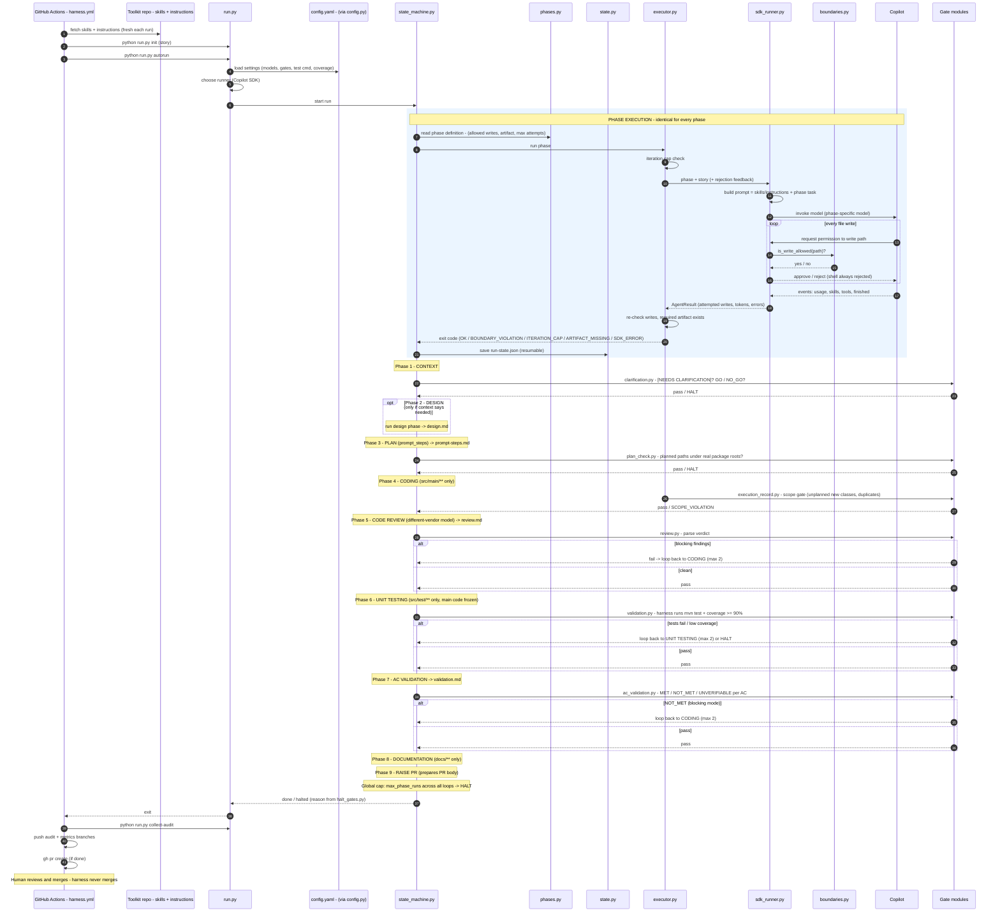

# SDLC Harness - End-to-End Sequence

**Notes**
- The blue box runs once per phase; the phase sections below only show what's different (the gate).
- Human approval gates (after context, design, plan, coding, docs) are auto-approved in CI by `autorun`; locally use `run.py approve / reject`.
- A halted run resumes at a chosen phase via `resume.py`.
